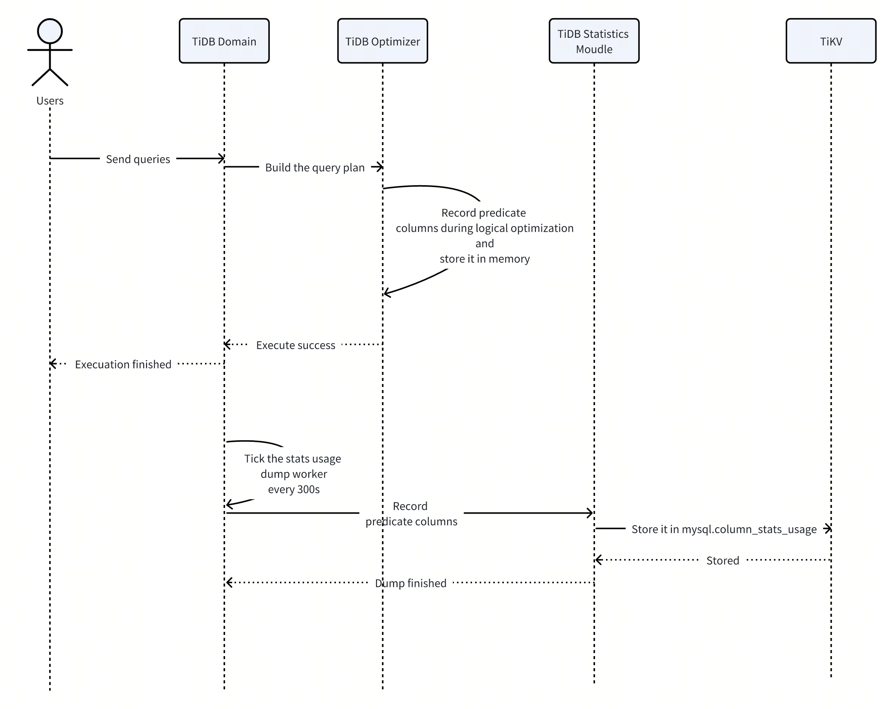

# Analyze Predicate Columns

- Author(s): [Rustin Liu](http://github.com/hi-rustin)
- Discussion PR: TBD
- Tracking Issue: TBD

## Table of **Contents**

- [Analyze Predicate Columns](#analyze-predicate-columns)
  - [Table of **Contents**](#table-of-contents)
  - [Introduction](#introduction)
  - [Motivation or Background](#motivation-or-background)
  - [Detailed Design](#detailed-design)
    - [ANALYZE Syntax](#analyze-syntax)
    - [Tracking Predicate Columns](#tracking-predicate-columns)
      - [Collect During Logical Optimization Phase](#collect-during-logical-optimization-phase)
      - [Flush Predicate Columns To The System Table](#flush-predicate-columns-to-the-system-table)
      - [Dataflow](#dataflow)
  - [Test Design](#test-design)
    - [Functional Tests](#functional-tests)
    - [Compatibility Tests](#compatibility-tests)
    - [Performance Tests](#performance-tests)
  - [Impacts \& Risks](#impacts--risks)
  - [Investigation \& Alternatives](#investigation--alternatives)
    - [CRDB](#crdb)
    - [Redshift](#redshift)
  - [Unresolved Questions](#unresolved-questions)

## Introduction

TBD

## Motivation or Background

The ANALYZE statement would collect the statistics of all columns currently. If the table is big and wide, executing `ANALYZE` would consume lots of time, memory, and CPU. See [#27358](https://github.com/pingcap/tidb/issues/27358) for details.****
However, only the statistics of some columns are used in creating query plans, while the statistics of others are not. Predicate columns are those columns whose statistics are used in query plans, usually in where conditions, join conditions, and so on. If ANALYZE only collects statistics for predicate columns and indexed columns (statistics of indexed columns are important for index selection), the cost of ANALYZE can be reduced.

## Detailed Design

### ANALYZE Syntax

```sql
ANALYZE TABLE tbl_name PREDICATE_COLUMNS;
```

Using this syntax, TiDB will only analyze columns thar appear in the predicate of the query.

Compare with other syntaxes:

| Analyze Statement                   | Explain                                                          |
|-------------------------------------|------------------------------------------------------------------|
| ANALYZE TABLE t;                    | It will analyze all analyzable columns from the table.           |
| ANALYZE TABLE t COLUMNS col1, col2; | It will only analyze col1 and col2.                              |
| ANALYZE TABLE t PREDICATE COLUMNS;  | It will only analyze columns that exist in the previous queries. |

### Tracking Predicate Columns

#### Collect During Logical Optimization Phase

As all the predicates need to be parsed for each query, we need to do it during the logical optimization phase.
It requires a new logical optimization rule, and we can use it to go through the whole plan tree and try to find all the predicate columns.

We will consider these columns to be the predicate columns:

- PushDown Conditions from DataSource
- Access Conditions from DataSource
- Conditions from Select
- GroupBy Items from Aggregation
- PartitionBy from the Window function
- Equal Conditions, Left Conditions, Right Conditions and Other Conditions from JOIN
- Correlated Columns from Apply
- SortBy Items from Sort
- SortBy Items from TopN
- Columns from the CTE if distinct specified

After we get all predicate columns from the plan tree, we can store them in memory. The reason for storing them in memory is that we don't want to slow down the optimization process by sending the request to TiKV.
Additionally, we want to record when this column was used, we also need to record the timestamp.

It is a map from `TableItemID` to `time.Time`:

```go
type TableItemID struct {
        TableID          int64
        ID               int64
        IsIndex          bool
        IsSyncLoadFailed bool
}

// StatsUsage maps (tableID, columnID) to the last time when the column stats are used(needed).
// All methods of it are thread-safe.
type StatsUsage struct {
        usage map[model.TableItemID]time.Time
        lock  sync.RWMutex
}
```

#### Flush Predicate Columns To The System Table

We use a new system table mysql.column_stats_usage to store predicate columns.

```sql
CREATE TABLE IF NOT EXISTS mysql.column_stats_usage (
        table_id BIGINT(64) NOT NULL,
        column_id BIGINT(64) NOT NULL,
        last_used_at TIMESTAMP,
        last_analyzed_at TIMESTAMP,
        PRIMARY KEY (table_id, column_id) CLUSTERED
);
```

The detailed explanation:

| Column Name      | Description                                          |
|------------------|------------------------------------------------------|
| table_id         | The physical table ID.                               |
| column_id        | The column ID is from schema information.            |
| last_used_at     | The timestamp when the column statistics were used.  |
| last_analyzed_at | The timestamp at when the column stats were updated. |

After we collect all predicate columns in the memory, we can use a background worker to flush them from the memory to TiKV. The pseudo-code looks like this:

```go
func (do *Domain) updateStatsWorker() {
    dumpColStatsUsageTicker := time.NewTicker(100 * lease)
    for {
        select {
            case <-dumpColStatsUsageTicker.C:
                statsHandle.DumpColStatsUsageToKV()
        }
    }
}

func (s *statsUsageImpl) DumpColStatsUsageToKV() error {
    colMap := getAllPredicateColumns
    for col, time := range colMap {
        StoreToSystemTable(col, time)
    }
}
```

We can spawn a background worker from the domain and flush the predicate columns to the system table every 5 minutes.

#### Dataflow



## Test Design

### Functional Tests

### Compatibility Tests

### Performance Tests

## Impacts & Risks

## Investigation & Alternatives

### CRDB

### Redshift

## Unresolved Questions
